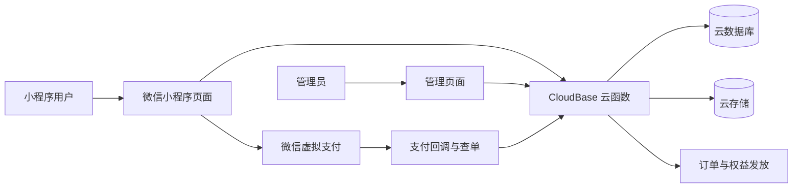

# 仕舟公考微信小程序

仕舟公考是一套基于微信原生小程序和腾讯云开发构建的公考学习应用，覆盖题库学习、错题复习、学习计划、打卡、资料领取、音频、壁纸、督学服务、会员、舟币和官方小程序虚拟支付，并提供管理员内容配置与 CSV 题库批量导入能力。账号登录必须通过微信官方能力授权并绑定手机号，手机号作为唯一业务标识。

## 当前状态

| 项目 | 状态 |
| --- | --- |
| 线上小程序版本 | 以微信公众平台“版本管理”为准 |
| 最新已上传开发版本 | `1.0.40`（2026-09-16 上传成功，尚未代为提交审核或发布） |
| 最近云端修复 | 2026-09-16：基础 VIP 增加 30 天督学权益，套餐配置和发放逻辑已部署 |
| 默认分支 | `main` |
| 云开发环境 | `cloud-2ge02vrucaf8a6ab` |
| 小程序 AppID | `wxca6ebd21699eca53` |
| 支付方式 | 微信官方小程序虚拟支付 |
| 订单中心路径 | `pages/order-center/order-center` |

2026-09-13 已完成本轮客户 12 项反馈的回归验收，包含正式云端读写、开发者工具页面交互和图片生成。2026-09-15 追加修复资料页舟币不足提示：适配原生弹窗按钮长度限制，增加资料页“去分享”入口，返回资料页自动刷新余额，并同步修正舟币中心规则文案。2026-09-16 将基础 VIP 调整为 198 元包年、包含 365 天 VIP 和 30 天督学，正式云端配置、支付发放、管理员赠送和页面展示已统一。两项修复已合并上传为 `1.0.40`，上传成功不等于审核通过或正式发布。本次验收记录见 [1.0.40 基础 VIP 督学权益与舟币提示验收记录](docs/release-1.0.40-basic-vip-supervision.md)。

`1.0.21` 新增客户可直接使用的零代码管理员工作台，支持批量内容管理、模块与题库管理、运营配置、用户权限赠送和正式小程序码。详细记录见 [1.0.21 发布与验收记录](docs/release-1.0.21-verification.md)。

`1.0.22` 强制所有登录账号绑定唯一手机号，并在本地会话恢复、云端登录和支付下单三层校验；历史账号补绑时保留原有用户 ID、管理员角色和业务记录。

`1.0.23` 将打包内客服二维码压缩至微信代码质量要求的 200 KB 以内，并新增图片、音频资源体积回归检查。

`1.0.24` 按微信开发者工具的实际规则，将主包全部图片和音频资源总量从约 490 KB 降至 159 KB，并将回归检查修正为“媒体总量小于 200 KB”。

`1.0.25` 将客服二维码从部分真机兼容性不足的 WebP 恢复为无损 PNG，保留原始像素内容，并继续将主包全部图片和音频资源总量控制在 200 KB 以内。

`1.0.26` 修复学习计划保存成功后仍停留在编辑页、用户无法看到保存结果的问题；显式保存后自动进入“我的新学本”，并增加保存按钮防重复提交保护。

`1.0.27` 统一学习计划日期格式与自然日计算，兼容历史云端日期数据；保存后“我的新学本”同步显示每日题数、完成日期和剩余天数。

`1.0.28` 修复打卡海报和包内 WebP 壁纸在部分真机上无法生成分享图的问题，统一相册权限拒绝后的恢复流程，补齐小程序码保存的隐私授权，并修复后台音频页面卸载后的滞后回调。上线前真实验收记录见 [1.0.28 上线前真实验收报告](docs/release-1.0.28-real-qa.md)。

`1.0.29` 修复 Logo、默认头像、课程封面、打卡背景和壁纸在部分微信/鸿蒙真机不显示的问题；主包关键图片统一改为基线 JPEG，清除包内 WebP，并增加本地素材引用、图片解码、云数据库引用与云存储对象一致性检查。详细记录见 [1.0.29 素材兼容修复与验收记录](docs/release-1.0.29-assets-verification.md)。

`1.0.30` 按微信审核“混淆行为”修改指引，将手机号授权入口统一改为“手机号快捷登录”，同步清理登录前置页面、用户协议和隐私政策中的易混淆登录表述，不改变手机号授权接口及账号绑定逻辑。

`1.0.31` 修复学习计划“完成日期”长期不变化的问题：日期改为按剩余题数和每日题数实时计算的“预计完成日期”，调整每日题数、完成新题或跨自然日后会自动更新；学习计划、我的新学本和日历使用同一计算规则，不再展示历史过期日期。

`1.0.32` 新增管理员题目管理：普通管理员与最高管理员均可按题库查看、搜索和编辑题目，可安全上下线题目，并在二次确认后永久删除。下线题目立即对普通用户隐藏，删除不会删除历史答题记录；每项写操作都会保留管理员审计记录。

`1.0.33` 统一题库、资料、音频和壁纸的上线状态判断，兼容新旧题库集合并修复已上线旧模块无法显示的问题；资料、音频、壁纸支持单条编辑、替换文件、手动序号和按名称重排，后台资料可搜索并显示至 500 条。同步修复打卡背景临时链接过期、默认背景更新不生效、普通管理员不能检索并赠送用户权限、督学续费套餐隐藏、资料舟币不足缺少分享引导、消息字数限制及题目长答案窄屏溢出。

`1.0.34` 修复 `1.0.33` 只改判定、未改写入导致的“点上线没反应”：上下线和新建模块/题库改为同时写 `enabled` 与 `status`，自动修复历史脏数据；排序值不再被钳到 1e9，后台可切换“按名称自动排序”并被记住（之后补传的内容自动落到正确位置，用户端顺序与后台一致）；后台列表显示真实总条数和截断提示；打卡海报改为“最后保存的立即生效”，并下线没有 `activeDate` 的历史背景、新增“恢复官方海报”入口；套餐配置页显示每个套餐在前台是否真的能买到及原因，并提供一键修正；长答案不再溢出题目卡片。详细记录见 [1.0.34 客户反馈修复记录](docs/release-1.0.34-customer-issues.md)。

## 主要功能

### 学习与题库

- 科目、题库和课程列表
- 选择题、填空题答题与答案解析
- 学习计划、日历、学习记录和艾宾浩斯复习
- 错题纠正、错题复习和学习统计
- 每日打卡及打卡海报生成

### 内容与服务

- 文档、音频和图片资料领取；每份资料首次领取固定消耗 10 舟币，重复打开不扣费
- 音频学习、后台播放和壁纸管理
- 督学匹配、督学计划和学习提醒
- 消息中心、互助问答、帮助与反馈
- 舟币明细、打卡海报分享奖励（每次 10 舟币、每天最多 20 舟币）和用户自定义壁纸

### 会员与支付

- 基础 VIP（365 天 VIP + 30 天督学）和高级 VIP（365 天 VIP + 365 天督学）
- 督学试用、督学包月和督学包年权益
- `wx.requestVirtualPayment` 官方虚拟支付
- 支付查单、自动发放权益、发货确认和退款回收
- 支付结果幂等处理及定时补偿
- 用户订单中心

### 管理员后台

- 统一“管理员工作台”，客户日常运营不需要修改代码或数据库
- 单题录入和 CSV 题库批量导入
- 按题库查看、搜索、编辑、上下线和永久删除题目
- 模块与题库新增、编辑、排序、安全上下线
- 资料、音频和壁纸批量上传、单条编辑替换、手动排序或按名称自动排序、搜索及上下线
- 固定正式会员套餐、广告位、站内群发、提醒和帮助内容配置
- 打卡背景和打卡文案配置
- 指定用户检索、一键赠送 VIP/督学权限和审计记录
- 自动生成、预览和保存正式小程序码

客户和运营管理员的完整操作说明见 [仕舟小程序管理员运营操作手册](docs/仕舟小程序管理员运营操作手册.md)。

## 技术架构

- 前端：微信原生小程序 JavaScript、WXML、WXSS
- 后端：腾讯云开发 CloudBase 云函数
- 运行时：Node.js 16.13、`wx-server-sdk`
- 数据：CloudBase 文档数据库和云存储
- 支付：微信小程序虚拟支付短剧道具模式
- 测试：Node.js 回归脚本、页面运行时扫描和真机验收



## 项目结构

```text
.
├── app.js                         小程序启动与云环境初始化
├── app.json                       页面、TabBar 和全局配置
├── pages/                         用户端与管理员页面
├── utils/                         登录、云函数、支付、CSV、分享等公共模块
├── cloudfunctions/                CloudBase 云函数
├── scripts/                       回归测试与发布检查
├── templates/                     客户题库导入模板
├── docs/                          部署、安全、验收和交付文档
├── cloudbaserc.json               云函数部署配置
└── project.config.json            微信开发者工具项目配置
```

## 本地运行

### 环境要求

- 微信开发者工具最新稳定版
- Node.js 16 或更高版本
- 已加入该小程序的开发者或管理员微信账号
- 对目标 CloudBase 环境具有开发权限

### 导入项目

```bash
git clone https://github.com/Jackey0903/shizhou-miniapp.git
cd shizhou-miniapp
```

1. 打开微信开发者工具。
2. 选择“导入项目”，项目目录选择仓库根目录。
3. 确认 AppID 为 `wxca6ebd21699eca53`。
4. 在云开发面板确认环境为 `cloud-2ge02vrucaf8a6ab`。
5. 编译并使用登录后的真实微信账号进行功能验证。

云环境同时配置在 `app.js` 和 `cloudbaserc.json`。如需部署到另一套环境，必须同步修改这两个文件，并重新配置数据库、存储权限、云函数环境变量和虚拟支付商品。

## 云函数部署

推荐在微信开发者工具中右键目标云函数，选择“上传并部署：云端安装依赖”。也可以使用 CloudBase CLI：

```bash
npx @cloudbase/cli login
npx @cloudbase/cli fn deploy createVipOrder -e cloud-2ge02vrucaf8a6ab --force
npx @cloudbase/cli fn deploy vipPayCallback -e cloud-2ge02vrucaf8a6ab --force
npx @cloudbase/cli fn deploy uploadQuestions -e cloud-2ge02vrucaf8a6ab --force
npx @cloudbase/cli fn deploy adminOperations -e cloud-2ge02vrucaf8a6ab --force
```

修改前端代码后需要重新上传小程序版本；只修改云函数时，部署对应云函数即可，不需要重新提交小程序审核。

不要在已经投入使用的正式环境随意运行初始化、种子或迁移函数。相关操作必须先备份数据库，并明确核对脚本用途。

## 数据与权限

主要集合包括：

| 范围 | 集合 |
| --- | --- |
| 用户与身份 | `users`、`phone_identities`、`tokens`、`manual_grants`、`admin_audit_logs` |
| 题库 | `subjects`、`question_banks`、`questions`、`courses` |
| 学习 | `plans`、`study_records`、`checkins`、`study_reminders` |
| 支付与权益 | `vip_plans`、`orders`、`coin_logs` |
| 资料与内容 | `materials`、`audios`、`wallpapers`、`user_wallpapers` |
| 消息与督学 | `messages`、`user_messages`、`supervision_profiles` |
| 运营配置 | `ad_slots`、`punch_backgrounds`、`punch_quotes`、`notification_settings`、`mini_program_codes`、`content_orderings` |

生产数据库集合使用 `ADMINONLY`。小程序页面不直接读写生产数据库，统一通过云函数校验当前微信 `OPENID`、管理员身份和字段白名单。云存储保持公开读取、创建者写入，不得将生产写权限放宽为所有用户可写。

用户登录必须先勾选用户协议和隐私政策，再通过 `getPhoneNumber` 获取一次性授权码，由 `userLogin` 云函数调用微信官方接口换取手机号。手机号是唯一业务标识，同一手机号只能绑定一个微信账号，已绑定账号不能在客户端自行换号；`phone_identities` 使用手机号哈希建立并发唯一锁，不重复保存明文手机号。`OPENID` 继续作为微信技术关联键，以保持历史答题、订单、学习记录和管理员权限不变。历史无手机号账号会在下次登录时强制补绑，补绑不会更改原用户 ID 或既有业务数据。

权限分为唯一“最高管理员”和普通“管理员”。最高管理员拥有全部后台权限，并可在“管理员工作台 -> 管理员管理”查看全部用户和管理员、按手机号/昵称/用户 ID 搜索用户、新增或取消普通管理员，以及移交最高权限；普通管理员只能维护日常运营内容，不能查看完整用户列表或管理管理员。

“管理员管理”提供“全部用户”和“管理员”两个视图。全部用户按稳定用户 ID 分页加载，确保没有登录时间字段的历史账号也不会遗漏；页面同时显示每个账号现有的最近登录时间，并且只返回授权所需的公开账号字段。用户列表、管理员列表、用户搜索和角色变更均由 `adminOperations` 云函数再次校验最高管理员身份，不能依赖隐藏页面入口作为权限边界。

首个最高管理员由软件服务商在交付时通过受保护的 `bootstrapSuperAdmin` 云端操作初始化。完成初始化后的用户字段为：

```json
{
  "isAdmin": true,
  "isSuperAdmin": true,
  "role": "super_admin"
}
```

普通管理员由最高管理员在小程序内设置，对应字段为：

```json
{
  "isAdmin": true,
  "isSuperAdmin": false,
  "role": "admin"
}
```

微信不会向小程序提供用户的私人微信号，因此不能按微信号直接授权。目标用户必须先登录小程序，最高管理员再用已绑定手机号、昵称或用户 ID 查找；涉及同名用户时必须通过手机号或用户 ID 核对。

## 虚拟支付

### 正式商品

| 业务套餐 | 微信道具 ID | 价格 |
| --- | --- | ---: |
| 基础 VIP 包年 | `sz_basic_vip_year` | ¥198 |
| 督学试用 1 日 | `sz_supervision_1d` | ¥8 |
| 督学包月 | `sz_supervision_mon` | ¥198 |
| 高级 VIP / 督学包年 | `sz_premium_vip_year` | ¥988 |

正式环境必须在微信公众平台“虚拟支付”中发布上述道具，并确保 ID 和价格与 `cloudfunctions/createVipOrder/index.js` 一致。

### 云函数环境变量

以下变量只配置在正式环境的 `createVipOrder` 云函数中：

```text
WECHAT_APP_SECRET
VIRTUAL_PAY_OFFER_ID
VIRTUAL_PAY_PROD_APP_KEY
VIRTUAL_PAY_ENV=0
```

禁止将 AppSecret、AppKey 或访问令牌写入页面代码、Git 仓库、截图、日志和问题单。正式环境不得使用 `VIRTUAL_PAY_ENV=1`。

支付流程为：创建本地订单、生成官方支付签名、调用收银台、查询微信订单、事务发放权益、通知微信发货。`vipPayCallback` 每 5 分钟补偿近 3 天待处理订单，失败订单采用指数退避和候选轮转，避免漏单、重复发放和无效重复查询。

完整配置见 [虚拟支付部署检查](docs/virtual-payment-deploy.md) 和 [虚拟支付现网配置](docs/虚拟支付现网配置.md)。

## 客户题库导入

### 规定文件格式

客户只提交一个 `.csv` 文件，不直接接收 `.xlsx`、`.xls`、Word 或 PDF。必须使用 [仕舟题库导入模板](templates/仕舟题库导入模板.csv)，编码为 UTF-8，分隔符为英文逗号。

固定表头不得删除、改名或换序：

```text
科目名称,题库名称,序号,题型,题目,选项A,选项B,选项C,选项D,答案,解析,图片URL
```

- 每题一行，科目名称、题库名称、题型、题目和答案必填。
- 题型填写“选择题”或“填空题”。
- 选择题至少填写 A、B 两个连续选项，答案只写 `A`、`B`、`C` 或 `D`。
- 填空题不填写选项，答案填写完整参考答案。
- 图片 URL 可留空；填写时只支持 `https://` 或 `cloud://`。
- 单个文件最大 5 MB、最多 5000 题；前端自动按每批 50 题上传。
- 重复题自动跳过，不会重复创建。

### 管理员导入流程

1. 进入“小程序 -> 我的 -> 题目录入”。
2. 点击“发送 CSV 模板”把固定模板发给客户。
3. 收到文件后点击“选择 CSV 文件”。
4. 检查整批校验结果、错误行号和前 5 题预览。
5. 校验通过后点击“确认导入”。系统自动创建缺少的科目和题库，并跳过重复题。
6. 导入完成后分别抽查一题选择题和一题填空题。

详细交付标准见 [客户题库交付与导入](docs/客户题库交付与导入.md) 和 [题库 CSV 导入说明](docs/题库CSV导入说明.md)。

## 测试

提交代码或发布前必须运行完整检查：

```bash
node scripts/verify-release-readiness.js
```

该命令覆盖 JavaScript 语法、手机号强制绑定与唯一性、登录、虚拟支付、支付补偿、VIP/督学套餐隔离、分享权限、打卡舟币、题库 CSV、管理员上传与授权、管理员工作台结构、学习流程、顺选/随机复习、全部页面控件、路由资源和关键安全规则。

需要单独定位问题时，可执行：

```bash
node scripts/regression-login-payment.js
node scripts/regression-vip-reconcile.js
node scripts/regression-customer-issues-round2.js
node scripts/regression-question-csv-import.js
node scripts/regression-question-upload-cloud.js
node scripts/regression-admin-uploads.js
node scripts/regression-image-share-permission.js
node scripts/regression-audio-lifecycle.js
node scripts/regression-learning-flow.js
node scripts/regression-review-navigation.js
node scripts/regression-control-inventory.js
node scripts/regression-control-handlers.js
node scripts/regression-security-critical.js
```

自动化测试通过后仍需用真机完成登录、答题、打卡分享、资料领取、管理员上传和至少一笔真实支付验收。

正式环境验收不能与纯本地回归混用：`e2e-production-reversible.js` 会临时创建内容、调整验收账号舟币并在结束后恢复，必须使用已授权且验收期间无人操作的账号；`e2e-background-config.js` 使用隔离的未来日期背景和停用消息，不向用户群发。执行前准备 CloudBase 登录及开发者工具连接，执行后检查清理结果。操作与最近结果见 [云端验收记录](docs/verification-2026-09-13.md)。

## 发布流程

1. 确认工作区干净，代码已提交并推送到 `main`。
2. 运行 `node scripts/verify-release-readiness.js`，结果必须为 `ok: true`。
3. 确认正式支付环境变量、四个微信道具和生产云函数均已配置。
4. 在微信开发者工具真机验证关键流程。
5. 上传新的开发版本，版本号必须递增。
6. 在微信公众平台提交审核，交易类小程序填写订单中心路径 `pages/order-center/order-center`。
7. 审核通过后发布，并在微信中重新进入小程序确认线上版本和支付。

版本说明、审核备注和验收证据参考 [1.0.20 发布与验收记录](docs/release-1.0.20-verification.md)。

## 常见问题

### 当前套餐尚未发布到微信支付

检查微信虚拟支付后台的道具是否已发布，并确认道具 ID、价格和正式 AppKey 与代码及云函数环境一致。

### 缺少 wx.login code

退出当前付款页后重新进入并发起支付。登录 code 只能使用一次，客户端不能缓存后重复使用。

### 已付款但权益暂未显示

先进入“我的 -> 我的订单”触发主动查单。服务端同时通过支付回调和定时任务补偿，禁止手工重复增加权益或重复写入支付流水。

### CSV 文件无法导入

确认文件扩展名为 `.csv`、编码为 UTF-8、表头完全一致，且没有合并单元格、缺失必填列或使用中文逗号。页面会显示具体错误行号。

### 管理页面不可见

确认当前微信对应的 `users` 文档具有 `isAdmin: true` 或 `role: "admin"`，重新登录后再进入“我的”。

## 文档索引

- [1.0.18 发布与验收记录](docs/release-1.0.18-verification.md)
- [1.0.20 发布与验收记录](docs/release-1.0.20-verification.md)
- [1.0.21 发布与验收记录](docs/release-1.0.21-verification.md)
- [1.0.28 上线前真实验收报告](docs/release-1.0.28-real-qa.md)
- [1.0.29 素材兼容修复与验收记录](docs/release-1.0.29-assets-verification.md)
- [1.0.30 登录审核合规修复记录](docs/release-1.0.30-login-review-fix.md)
- [1.0.34 客户反馈修复记录](docs/release-1.0.34-customer-issues.md)
- [虚拟支付部署检查](docs/virtual-payment-deploy.md)
- [虚拟支付现网配置](docs/虚拟支付现网配置.md)
- [客户题库交付与导入](docs/客户题库交付与导入.md)
- [题库 CSV 导入说明](docs/题库CSV导入说明.md)
- [生产云安全策略](docs/cloud-security-policy.md)

## 安全要求

- 不提交 `project.private.config.json`、生产密钥、访问令牌、数据库导出或客户原始资料。
- 不在客户端信任用户提交的管理员、支付状态、手机号或权益字段。
- 登录、恢复本地会话和创建支付订单都必须验证已绑定手机号；手机号冲突或换号只能由服务端拒绝并交由客服核验。
- 支付和权益发放必须以微信服务端订单状态为准，并保持幂等。
- 修改数据库或存储权限前先备份并执行安全回归。
- 正式发布前必须完成自动化检查和真机验收。
